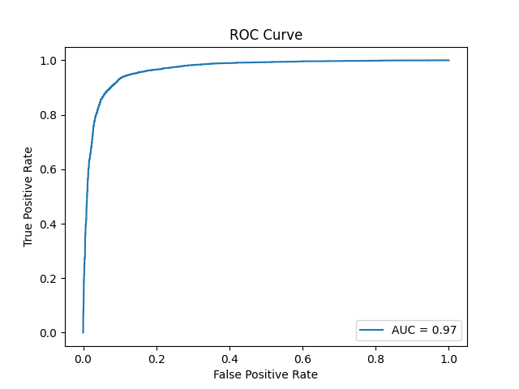
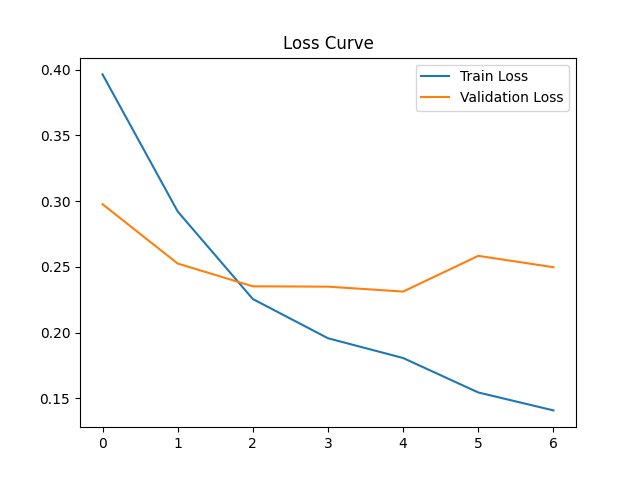

# Depression Detection from Social Media Text

A Deep Learning-based NLP system for detecting depressive tendencies in Reddit-style social media posts using traditional machine learning and sequential neural network architectures.

The project explores text classification workflows, model comparison, deployment pipelines, and ethical AI considerations for mental health-related NLP applications.


## Live Demo

🔗 https://depression-detection-mp9i.onrender.com/


## Project Overview

This project presents an NLP-based mental health text classification system designed to identify depressive tendencies in social media content.

The primary objective is to compare traditional machine learning methods with sequential deep learning architectures for binary text classification tasks.

The system integrates:

- NLP preprocessing workflows
- Traditional ML baselines
- LSTM and BiLSTM architectures
- Model evaluation pipelines
- Flask deployment
- Docker containerization
- Web-based prediction interface


## Problem Statement

Early identification of depressive linguistic patterns may support mental health research and AI-assisted intervention systems.

The project classifies user-generated posts into:

- `0 → Not Depressed`
- `1 → Depressed`

⚠️ This system is intended for educational and research purposes only and is NOT a clinical diagnostic tool.


## Dataset

### Source
- Reddit Depression Dataset

### Dataset Details
- Balanced subset: 60,000 samples
- Input: Combined `title + body`
- Output: Binary classification label


## NLP Preprocessing Pipeline

The preprocessing workflow includes:

- Lowercasing
- URL removal
- Special character removal
- Tokenization
- Vocabulary size limitation
- Sequence padding

### Configuration

- Vocabulary Size: `10,000`
- Sequence Length: `200`


## Models Implemented

### 1. TF-IDF + Logistic Regression

Traditional machine learning baseline using TF-IDF vectorization and linear classification.

#### Characteristics
- Sparse feature representation
- Fast training workflow
- Strong baseline performance


### 2. LSTM

Sequential deep learning model using Long Short-Term Memory networks.

#### Architecture
- Embedding Layer
- Unidirectional LSTM
- Fully Connected Layer
- Sigmoid Activation


### 3. BiLSTM (Final Model)

Bidirectional LSTM architecture used as the final deployed model.

#### Architecture
- Embedding Layer
- Bidirectional LSTM
- Dropout Regularization
- Fully Connected Output Layer
- Early Stopping
- Best Validation Checkpoint


## Results Comparison

| Model | Accuracy | F1 Score |
|--------|----------|----------|
| Logistic Regression | 0.9180 | 0.9164 |
| LSTM | 0.9155 | 0.9149 |
| BiLSTM (Final) | 0.9114 | 0.9115 |


## Additional Evaluation Metrics

- ROC AUC: ~0.97
- Confusion Matrix
- Validation Loss Monitoring
- Train / Validation / Test Split
- Early Stopping
- Loss Curve Tracking

The evaluation workflow emphasizes reproducibility and rigorous experimental methodology.


## Evaluation Visualizations

### ROC Curve



### Training Loss Curve




## System Architecture

```text
Frontend (HTML/CSS/JS)
        │
        ▼
Flask REST API
        │
        ▼
PyTorch BiLSTM Model
        │
        ▼
Docker Container
        │
        ▼
Render Deployment
```


## Technologies Used

### Machine Learning & NLP
- Python
- PyTorch
- Scikit-learn
- NLTK

### Deep Learning
- LSTM
- BiLSTM

### Backend
- Flask
- REST API Workflows

### Deployment
- Docker
- Gunicorn
- Render

### Frontend
- HTML
- CSS
- JavaScript

### Tools
- Git & GitHub


## Docker Deployment

The application is containerized using Docker for reproducibility and deployment consistency.

### Docker Features

- `python:3.10-slim` base image
- Gunicorn production server
- Port 5000 exposure
- Deployment-ready configuration


## Running Locally

### 1. Install Dependencies

```bash
pip install -r requirements.txt
```

### 2. Run Flask Application

```bash
python app.py
```

### 3. Open in Browser

```text
http://localhost:5000
```


## Running with Docker

### Build Docker Image

```bash
docker build -t depression-detection-app .
```

### Run Docker Container

```bash
docker run -p 5000:5000 depression-detection-app
```


## Project Structure

```text
depression-detection/
│
├── data/
├── models/
├── report/
├── src/
├── static/
├── templates/
│
├── .dockerignore
├── .gitignore
├── Dockerfile
├── Procfile
├── app.py
├── requirements.txt
│
├── loss_curve.png
├── roc_curve.png
│
└── README.md
```

## Learning Outcomes

Through this project, I explored:

- NLP preprocessing workflows
- Sequential deep learning architectures
- LSTM and BiLSTM implementation
- Model evaluation methodologies
- Text classification pipelines
- Flask deployment workflows
- Docker containerization
- Production-oriented ML deployment
- Ethical AI considerations


## Future Improvements

- Transformer-based architectures (BERT / RoBERTa)
- Explainable AI visualizations
- Multilingual support
- Real-time inference optimization
- Hugging Face deployment
- RAG-enhanced mental health assistance
- Cloud-native deployment workflows
- Advanced NLP evaluation metrics


## Ethical Considerations

- This system does NOT provide medical diagnosis
- Social media datasets may contain bias
- Misclassification risk exists
- Human oversight is essential
- Predictions should not replace professional mental health support

The project is intended strictly for educational and research-oriented NLP experimentation.


## Research Areas

This project relates to:

- Natural Language Processing
- Mental Health AI
- Deep Learning
- Text Classification
- Ethical AI
- Sequential Neural Networks
- AI Deployment Systems


## Contributing

Suggestions and improvements are welcome.

Areas of interest include:

- NLP
- LLMs
- Ethical AI
- Mental Health Analytics
- Explainable AI
- Deep Learning Optimization


## Author

**Mohammad Alquamah Ansari**  
B.Sc. Artificial Intelligence

GitHub: https://github.com/alqamahansari  
Portfolio: https://alqamahansari.github.io/


## License

This project is developed for educational and research purposes only.
